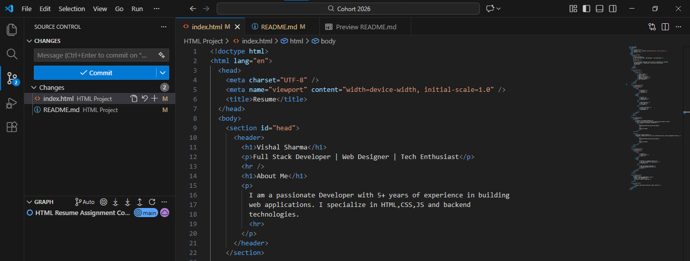
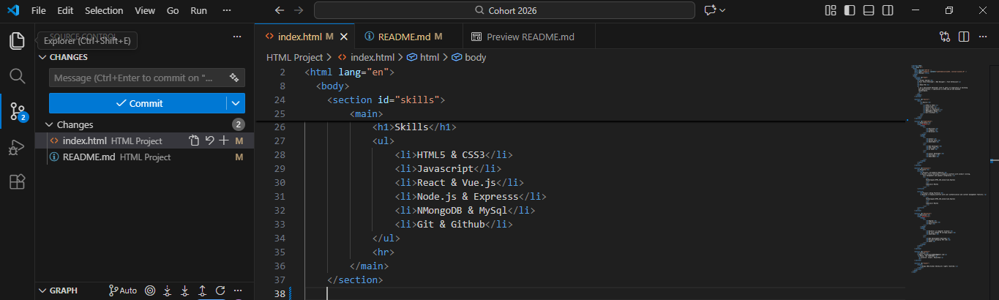
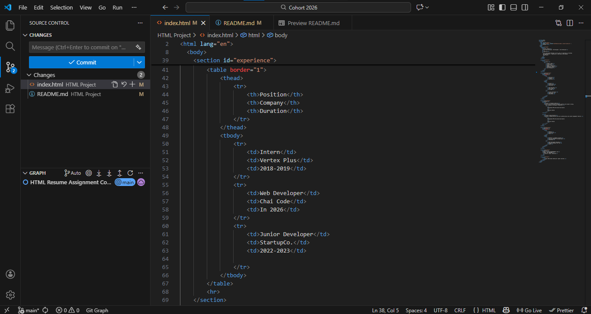
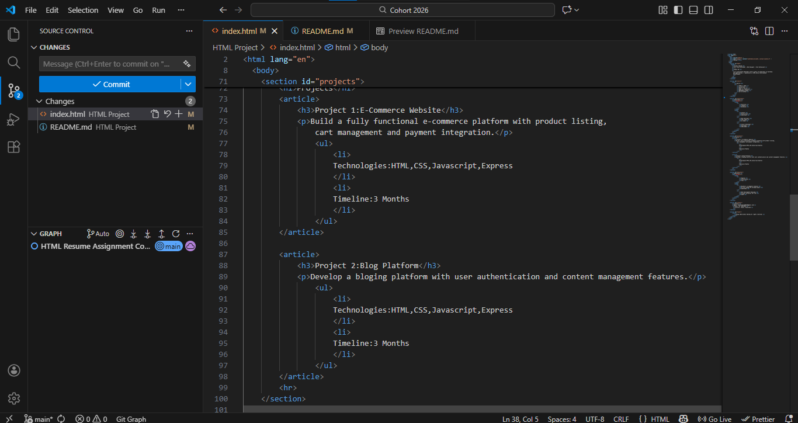
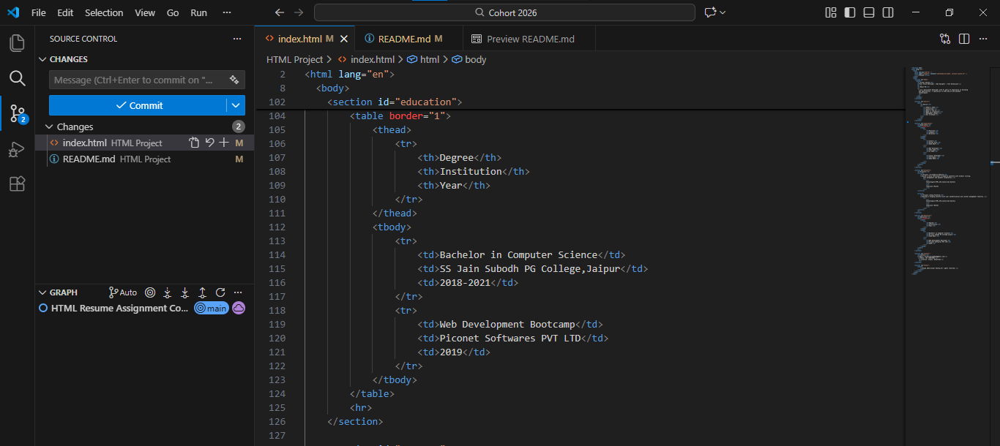
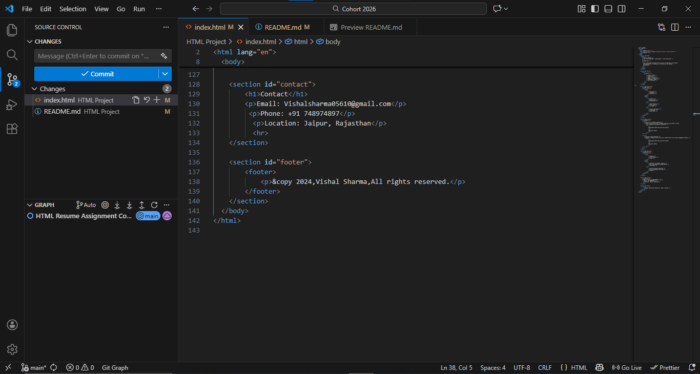

## Html Resume Assignment

## Overview
A Single-page resume website build in HTML.

## Live-Demo Link
https://vishall-resume.netlify.app/

## Features

1. Uses Semantic structure of HTML such as header,section,article.
2. No use of CSS.
3. Clean and readable code.

## Setup Steps

Follow these steps to view the project on your local machine

1. Step 1 :- Clone the Project or Download the project folder to your computer and unzip it.
2. Step 2 :- Open the folder and look for the file named index.html.
3. Step 3 :- Right-click on index.html file and open it with any browser.

## Code Screenshots

### Screenshot 1 :

### Screenshot 2 :

### Screenshot 3 :

### Screenshot 4 :

### Screenshot 5 :

### Screenshot 6 :

